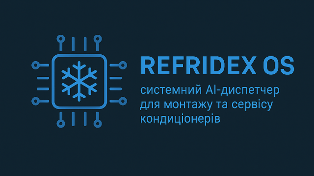

Цей проєкт розроблений для інтерактивного використання в Telegram. Бот створений для пошуку інформації, роботи з базами даних, інтеграції зі штучним інтелектом та взаємодії з користувачем через зручні меню.

---

## 📂 Структура проєкту

```
├── config.py
├── database
│   ├── db_pool_manager.py
│   ├── __init__.py
│   ├── telethon_sessions_db.py
│   └── users_db.py
├── handlers
│   ├── admin_handler.py
│   ├── __init__.py
│   ├── menu_handler.py
│   ├── reply_keyboard_handler.py
│   └── start_handler.py
├── __init__.py
├── keyboards
│   ├── admin_keyboard.py
│   ├── __init__.py
│   ├── inline_keyboard.py
│   └── reply_keyboard.py
├── main.py
├── middlewares
├── README.md
├── requirements.txt
├── states
│   ├── admin_states.py
│   └── __init__.py
├── telethon_client.py
└── utils
    ├── auth_check.py
    ├── __init__.py
    └── logger.py
```

Коментарі до структури

    config.py: Тут будуть зберігатися всі налаштування бота, такі як токен Telegram, дані для підключення до бази даних тощо.
    database/: Містить модулі для роботи з базою даних. Ти вже передбачив пули з'єднань, базу даних для сесій Telethon і базу даних користувачів. Це дуже добре для масштабованості.
    handlers/: Це основне місце для обробників команд та повідомлень бота. Кожен файл може відповідати за певний розділ функціоналу (адмін-команди, стартове меню, обробка кнопок тощо).
    keyboards/: Модулі для створення та управління клавіатурами (як ReplyKeyboard, так і InlineKeyboard). Це допоможе тримати логіку інтерфейсу окремо від логіки обробки.
    logs/: Директорія для зберігання логів бота, що дуже важливо для відладки та моніторингу.
    main.py: Головний файл, який буде запускати бота, ініціалізувати всі компоненти та реєструвати обробники.
    middlewares/: Тут можна буде додавати проміжне програмне забезпечення, яке буде виконуватися перед обробниками. Наприклад, для перевірки автентифікації користувача або логування.
    states/: Для управління станами користувачів (наприклад, під час діалогу, коли боту потрібно "пам'ятати" на якому кроці знаходиться користувач).
    telethon_client.py та файли .session: Ймовірно, ти плануєш використовувати бібліотеку Telethon для якихось додаткових функцій, таких як взаємодія з Telegram API як користувач (наприклад, для парсингу каналів або іншого).
    utils/: Різні допоміжні утиліти, які можуть бути використані в різних частинах бота (наприклад, логування, перевірка прав доступу).
